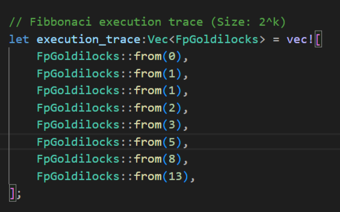

# Stark


## Description
Implementation of stark.*Not suitable for production use*.

## Table of Contents
- [Installation](#installation)
- [Usage](#usage)
- [Reference](#reference)

## Installation
Ensure you have [Rust](https://www.rust-lang.org/tools/install) and [Cargo](https://doc.rust-lang.org/cargo/) installed. To install the project, run:
```bash
git clone https://github.com/Saksham010/mini-stark/
cd mini-stark
```

## Usage

### Computation
Computation is handwired as fibbonacci sequence 
 *Ensure that number of gates is in 2^n*



### Proof Generation
*Proof generated form the values that does not satisfy the constraint is rejected*

Generate proof by running:
```bash
cargo run --bin prover
```
Copy the proof string.

### Proof Verification
Honest verifier will run the recieved proof with the verifier algorithm.
```bash
cargo run --bin verifier REPLACE_WITH_PROOF
```
The verification algorithm will output whether the proof is valid or not in the console.

## Reference
References are listed here: https://github.com/Saksham010/awesome-zk-stark